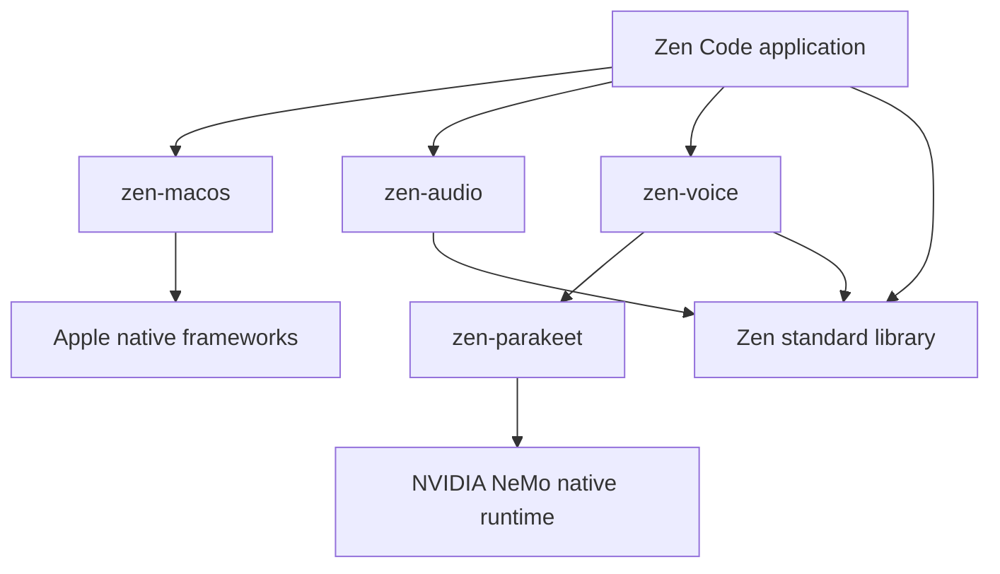

# Zen Code library architecture

Zen Code composes independently testable source libraries through `build.zen`.
The app repository keeps its historical zen-tui name. The executable/bundle is
ZenCode / ZenCode.app and the display name is Zen Code.

| Owner | Responsibility | Excluded concerns |
|---|---|---|
| zen-macos | Native window/input, Metal presentation, AudioQueue capture, permission display, monotonic time, bundle resources | Speech inference and DSP |
| zen-audio | FFT, speech-frequency display mapping, smoothing, WAV encoding | Devices, windows, actors, models |
| zen-parakeet | Direct native ABI, model/result lifetime, synchronous recognition | UI and microphone policy |
| zen-voice | Copied actor messages, asynchronous recognition, bounded mailbox and live-segment scheduling | Window state, audio device handles, display history |
| Zen Code | Input/display history, model configuration, shortcuts, capture/voice coordination | Compiler/runtime implementation |

The main thread owns AppKit and capture callbacks. A single inference actor owns
its cached native recognizer; a result actor sends copied replies through the
Darwin pipe adapter to the app's event loop. A finalized current-session result
is committed before its exact audio prefix is consumed. Capture continues into
the retained tail. The current bridge is explicitly macOS-specific, even though
zen-voice has no AppKit dependency.

PCM, scratch buffers, and history use caller-owned Zen allocators. Raw capture
pointers are copied into actor messages, not shared with worker threads. UI
history remains in `src/history.zen`, separate from the speech library. The old
`src/transcription.zen` only re-exports compatibility names; it does not maintain
a second implementation.

Native math calls live behind std.math. Apple frameworks and NVIDIA's inference
engine remain external native dependencies; orchestration, capture callbacks,
DSP, actor behaviors, configuration, and library adapters are Zen. No handwritten
C forwarding shim or Python inference process is introduced.

Further separation should follow a second concrete consumer. In particular,
zen-macos still has a convenience App UI; extracting a general UI toolkit before
there is an editor/document model would make an untested abstraction. Full code
editing, undo, projects, PTY integration, and durable transcription are subsequent
milestones, not features claimed by this refactor.
