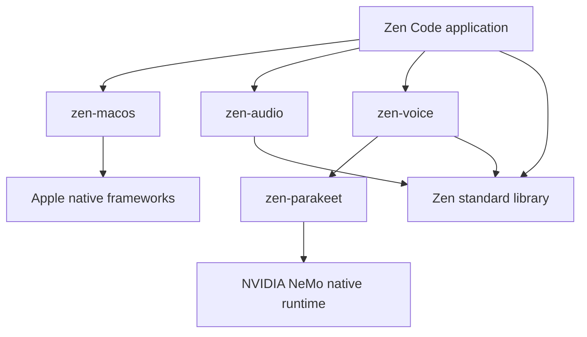

# Zen Code library architecture

Zen Code composes independently testable source libraries through `build.zen`.
The repository keeps its historical zen-tui name; the application is Zen Code.
It provides a local voice workspace and an opt-in single-document editor.

| Owner | Responsibility | Excluded concerns |
|---|---|---|
| Zen std | Allocators, actors, process execution, clocks and portable statistics | Application policy and Apple device handles |
| zen-macos | Native window/input, Metal presentation, capture, permissions, display scheduling, bundle resources and atomic file publication | Speech inference, DSP and document policy |
| zen-audio | FFT, voice-frequency display mapping, smoothing and WAV encoding | Devices, windows, actors and models |
| zen-parakeet | Direct native ABI, model/result lifetime and synchronous recognition | UI and microphone policy |
| zen-voice | Copied actor messages, preparation/recognition, bounded admission and live-segment scheduling | Window state, device handles and document history |
| Zen Code | Documents, text/history, configuration, shortcuts, export actor, packaging and capture/voice coordination | Compiler/runtime implementation |

The main thread owns AppKit, capture callbacks and documents. A single inference
actor owns its cached recognizer. Preparation loads that recognizer and warms it
with synthetic silence before capture is enabled. A result actor sends copied,
tagged replies through a Darwin pipe adapter to the app's event loop. A finalized
current-session result is committed before its exact audio prefix is consumed;
capture retains audio that arrived during inference. The bridge is macOS-specific
even though zen-voice has no AppKit dependency. Segments do not overlap, and the
model performs repeated offline decoding rather than native stateful streaming.

PCM, scratch buffers and text use caller-owned Zen allocators. Capture pointers
are copied into actor messages, not shared with workers. Optional WAV export is
an app-owned actor using zen-audio encoding and zen-macos atomic publication.
Its mailbox bounds pending work; it logs worker I/O failures and does not supply
a durable full-session archive. See [threading](THREADING.md) for exact bounds,
shutdown order and remaining main-thread work.

`src/document.zen` owns a bounded UTF-8 document, cursor, one-edit undo and saved
baseline. `src/editor.zen` translates native key events and finalized dictation
into document edits. Save checks the on-disk bytes against the baseline before
atomic publication; it detects earlier external changes but is not a filesystem
compare-and-swap against concurrent writers. This policy stays in the app; the
native file operation belongs in zen-macos. Voice-workspace display history stays
in `src/history.zen`. `src/transcription.zen` only re-exports compatibility names.

Model paths live in the user's Application Support directory, with an environment
override and legacy development-bundle read fallback. Updating configuration does
not modify a signed app. The Zen `zen-package` target stages a separate bundle,
resolves the SDK's transitive dylibs, rewrites bundle-relative load paths, copies
license notices and ad-hoc signs. Models remain external, explicitly configured
files. Local relocation and SDK-denial tests do not establish fresh-Mac behavior,
Developer ID signing or notarization.

Native math calls live behind std.math. Apple frameworks and NVIDIA's inference
engine remain native dependencies; orchestration, callbacks, DSP, actor behaviors,
configuration, editor policy and packaging are Zen. No handwritten C forwarding
shim or Python inference process is introduced.

## Remaining work

- Editor selection, clipboard/IME support, redo, multi-document/project handling,
  richer rendering and PTY integration; the current document capacity is 64 KiB.
- Fresh-Mac validation, Developer ID signing and notarized distribution.
- Capture-to-visible-text latency, presentation deadline measurements, a frame-time
  graph and optional telemetry export; current FPS measures submissions.
- Segment overlap with tested transcript reconciliation and a genuinely streaming
  backend, plus sustained recognition-quality tests.
- A generic pollable std actor channel. Compiler optimization and SIMD should
  follow measured bottlenecks; typed native handles need a settled design.

Extract a separate UI toolkit when another application establishes reusable
requirements. See [benchmarks](BENCHMARKS.md) for measured performance limits.
